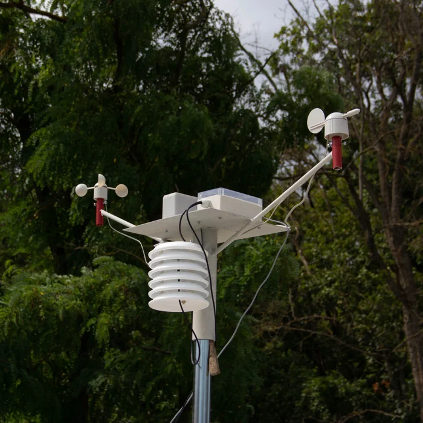

# meteo

Ce projet vise à aborder la problématique d'intégration de services. 

Vous disposez d'un objet (ESP ou smartphone ou ?) capable de prendre des 
mesures potentiellement intéressantes pour une thématique donnée, ici la météo :
  * un capteur de température, 
  * un capteur d'humidité, 
  * un anémomètre ...

Vous pourriez vous faire votre mini station météo MAIS SI vous pouviez accéder 
à d'autres données vous pourriez améliorer vos affichages/prédictions
/"émettre une alerte"/réguler un arrosage/ ...

Vous pourriez :

1) Bénéficier des services météo mis à disposition par des plateformes 
spécialisées et proposant des API d'accés.

Par exemple :
  * [Openweathermap](https://openweathermap.org/)
  * [Aerisweather](https://www.aerisweather.com/)
  * (https://www.wunderground.com/) 
    
    (https://developer.ibm.com/technologies/iot/tutorials/collect-display-hyperlocal-weather-data-from-a-pws-cfc-starter-kit-1/)
  
2) Bénéficier des données d'une communauté d'amis qui disposent eux aussi 
de capteurs

3) Il existe aussi des plateformes qui permettent de "participer" à la construction 
d'une connaissance globale
* (https://weathercloud.net/)
   
4) enfin vous pourriez produire une API qui permettrait d'accéder à vos connaissances
   comme par exemple:
   * (https://products.wolframalpha.com/simple-api/documentation/)
   
## Focus point : CE QUI m'INTERESSE de vous voir étudier, essayer, critiquer ...

L'intégration de services ... et la météo semble un bon prétexte !

(https://www.ibm.com/blogs/internet-of-things/incorporating-weather-data-into-iot/)

(https://datasmart.ash.harvard.edu/news/article/how-cities-are-using-the-internet-of-things-to-map-air-quality-1025)

