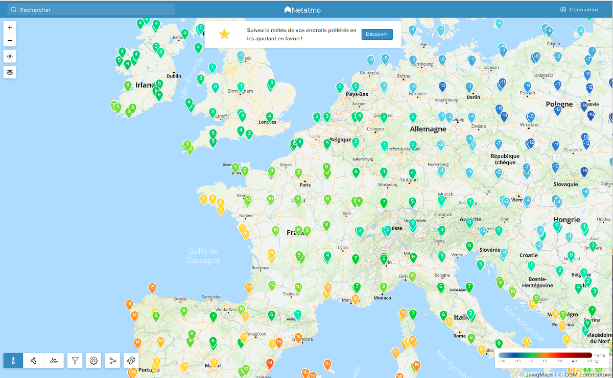

# meteo

Ce projet aborde la problématique de l'intégration de services.
La météo semble un bon prétexte et en tout cas c'est un réel challenge
:

(https://www.ibm.com/blogs/internet-of-things/incorporating-weather-data-into-iot/)

Visiblement tendance !

(https://docs.microsoft.com/fr-fr/azure/iot-hub/iot-hub-weather-forecast-machine-learning)

## Première phase
Vous disposez d'un objet (ESP ou smartphone ou ?) capable de prendre des 
mesures potentiellement intéressantes pour une thématique donnée, ici la météo :

* un capteur de température, 
* un capteur d'humidité, 
* un anémomètre ...

Vous pourriez vous faire votre mini station météo des données à votre
localisation.

## Seconde phase
Vous avez des amis/collègues capables de se joindre à "votre" réseau
et vous pouvez afficher leurs données sur votre dashboard.

Votre "communauté d'amis" se trouve sur toute la planète et eux aussi
peuvent utiliser ce dashboard.

* (https://weathermap.netatmo.com/)

A ce stade, vous pourriez produire une API qui permettrait d'accéder à
vos connaissances comme par exemple:
   
* (https://products.wolframalpha.com/simple-api/documentation/)

## Troisième phase
Vous aimeriez pouvoir intégrer la météo de certains lieux où vous
n'avez pas d'amis et donc vous allez utiliser/intégrer des
plateformes qui propose des services.

Ces plateformes vont de plus vous permettre de bénéficier de
prédictions et par conséquent vous pouvez "émettre une alerte"/réguler
(empêcher si il va pleuvoir ?) un arrosage / ...

Exemple de plateforme:

* [Openweathermap](https://openweathermap.org/)
* [Aerisweather](https://www.aerisweather.com/)
* (https://www.wunderground.com/) 
    
  (https://developer.ibm.com/technologies/iot/tutorials/collect-display-hyperlocal-weather-data-from-a-pws-cfc-starter-kit-1/)
  
Si vous avez des pigeons, vous pouvez aussi les utiliser :-)

(https://datasmart.ash.harvard.edu/news/article/how-cities-are-using-the-internet-of-things-to-map-air-quality-1025)

## Quatrième phase : Intégration de données

Il existe aussi des plateformes qui permettent de "participer" à la construction 
d'une connaissance globale

* (https://weathercloud.net/)

Vous pourriez placer votre projet comme un concurrent ... et dans ce
cas j'aimerais que vous réfléchissiez à un moyen de gérer les "mauvaises
données".

* Mauvaises parce que positionner un capteur de température n'est pas
  "chose" facile. Si il est abrité, il fournira des valeurs "biaisées".

* Mauvaises parce qu'un objet peut intentionnellement "polluer" votre
  système.
  

